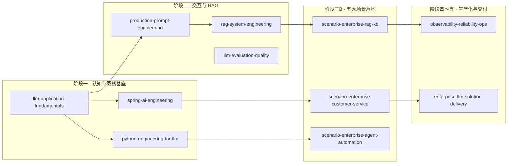

# 大模型应用开发 · 交互式课程

**Python × Spring AI 双轨并行** · 统一案例 **CorpAssist** · 面向 **3–5 年工程经验**（建议已有 Java 分布式 / Spring Boot 基础）

不是「看几篇博客就上手」的碎片资料，而是一套可离线打开的 **HTML 交互教程站**：分阶段大纲、章节测验、进度勾选、术语 AI 解释、Mermaid 架构图与配套 Demo 实验室——从 Token 与 API 契约，一直走到 RAG、Agent、五大企业场景落地与生产化交付。

---

## 30 秒开始

```powershell
cd courses
npx --yes serve .
```

浏览器打开终端提示的地址（一般为 `http://localhost:3000`），进入 **课程中心** → 选择 **《大模型应用基础》** 即可开学。

> 必须在 `courses/` 目录启动静态服务，否则课程中心无法 `fetch` 目录文件。

---

## 你会得到什么

| 亮点 | 说明 |
|------|------|
| **24 门课 · 337 章** | 共用轨 + Python 轨 + Spring AI 轨 + 汇合轨 + 场景落地轨，大纲见 [`courses/outline-specs.json`](courses/outline-specs.json) |
| **一条业务线讲到底** | 全系列围绕企业智能助手 **CorpAssist**（制度问答、客服、Agent 自动化、代码辅助、内容工坊） |
| **面试 TOP5 直达** | S1～S5 各对应一门 `scenario-enterprise-*` 场景课，与能力课路线图对齐 |
| **双栈可交付** | Python 快速验证 RAG / 评测；Spring AI 承接 BFF、网关、治理与企业集成 |
| **应用工程视角** | 聚焦编排、数据、评测、合规与可观测——**不**讲预训练、CUDA 内核、千卡训练 |
| **37 项能力对标 JD** | 能力矩阵与招聘关键词见 [`courses/REFERENCE.md`](courses/REFERENCE.md) |

### 课程站内置能力

- 章节正文 + **章节测验**（单选 / 多选 / 填空）
- 浏览器本地 **学习进度**与过关清单
- 划词 **术语探索**（结合 CorpAssist 场景的解释提示）
- **动手练习** + `demos/` 实验室（脚本、模板、检查清单）
- 明暗主题、目录导航、代码复制与 Mermaid 全屏

---

## 当前进度

| 状态 | 课程 |
|------|------|
| **已发布（15/15 章）** | [`llm-application-fundamentals`](courses/llm-application-fundamentals/) — 大模型应用基础：Token、架构拼图、双栈首次调用、多模态/国产化、系统设计、毕业路线图 |
| **大纲就绪，正文生成中** | 其余 23 门课（门户可见，章节陆续开放） |

建议路径：**先修完共用轨第一课** → 并行进入 `python-engineering-for-llm` 与 `spring-ai-engineering`。

---

## 学习路径一览



更完整的阶段表与并行关系见 [**课程中心说明**](courses/README.md)。

---

## 适合谁

- 有 **Java 分布式 / 微服务** 经验，想转 **大模型应用开发** 的后端工程师  
- 需要同时掌握 **Python 原型能力** 与 **Spring AI 企业接入** 的复合型岗位候选人  
- 准备 **RAG / Agent / 智能客服 / 知识库** 类系统设计面试，希望有结构化练习与统一项目叙事  

---

## 仓库结构

```text
study-profile-0/
├── README.md                 # 本文件
└── courses/
    ├── index.html            # 课程中心（入口页）
    ├── courses.json          # 门户目录（24 门课元数据）
    ├── outline-specs.json    # 大纲与场景规划真源
    ├── REFERENCE.md          # 37 能力 + 面试 TOP5 速查
    ├── README.md             # 启动方式与维护约定
    ├── scripts/sync.mjs      # 大纲 → 门户目录同步
    └── <slug>/               # 单门课（chapters、测验、demos）
```

---

## 维护与贡献

- 改大纲：编辑 `courses/outline-specs.json` 后执行 `node courses/scripts/sync.mjs`  
- 单课正文：维护 `courses/<slug>/chapters/*.html`，再 assemble 生成 `index.html`（详见 [`courses/README.md`](courses/README.md)）  

---

## 下一步

1. 启动课程中心，学完 **《大模型应用基础》** 15 章  
2. 按 [`advanced-05-capstone-plan`](courses/llm-application-fundamentals/) 制定个人 **CorpAssist 里程碑**  
3. 进入双轨：**Python 工程化** + **Spring AI 工程化**，再攻 **RAG 系统工程** 与 **场景落地课**  

**现在就开始 →** `cd courses && npx --yes serve .`
