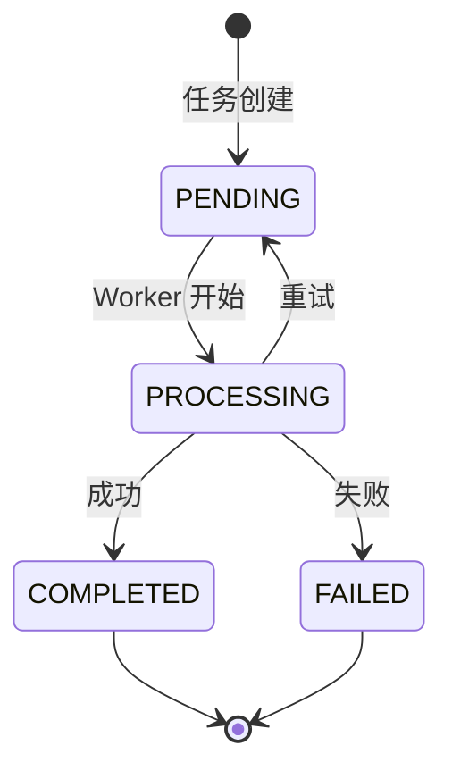

# Demo：同步、异步与 MQ

[章节](../../index.html#ch-practice-03-sync-async)

## 目标

实现长任务的 202 Accepted + Job Status 模式，画出异步任务三态图。

## 操作步骤

### 1. 实现异步索引 API

- Spring BFF 接收请求后返回 202 Accepted + job_id
- 发布索引任务到 RabbitMQ
- Python Celery Worker 消费并执行索引
- 索引完成后通过 MQ 回调通知 BFF

### 2. 实现 Job Status 端点

- GET /api/v1/index/jobs/{jobId} 查询任务状态

### 3. 画出异步任务三态图



## 验证命令

```bash
# 提交异步索引任务
curl -X POST http://localhost:8081/api/v1/index/batch \
  -H "X-Tenant-Id: corp-001" \
  -d '{"files": ["doc1.pdf", "doc2.pdf"]}'
# 返回 202 {job_id, status_url}

# 查询任务状态
curl http://localhost:8081/api/v1/index/jobs/{job_id}
```

## 验收标准

- [ ] 202 Accepted API 实现（返回 job_id + status_url）
- [ ] Celery Worker 消费并处理索引任务
- [ ] Job Status 状态机正确（pending→processing→completed/failed）
- [ ] 画出异步三态图

## 参考资料

- [RabbitMQ + Spring](https://www.rabbitmq.com/tutorials/tutorial-one-spring-amqp.html)
- [Celery Task](https://docs.celeryq.dev/en/stable/userguide/tasks.html)
